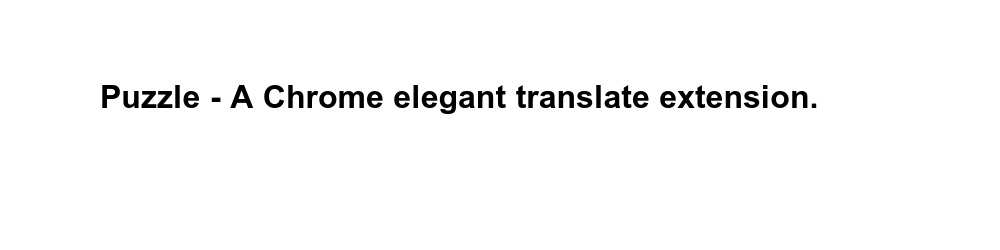

# Puzzle

`A Chrome elegant translate extension.`

- - -

### Usage

>1. Download OR Install plugin in ChromeStore;
2. Click Puzzle options button to start it;
3. Select your words in pages;
4. Nothing.

